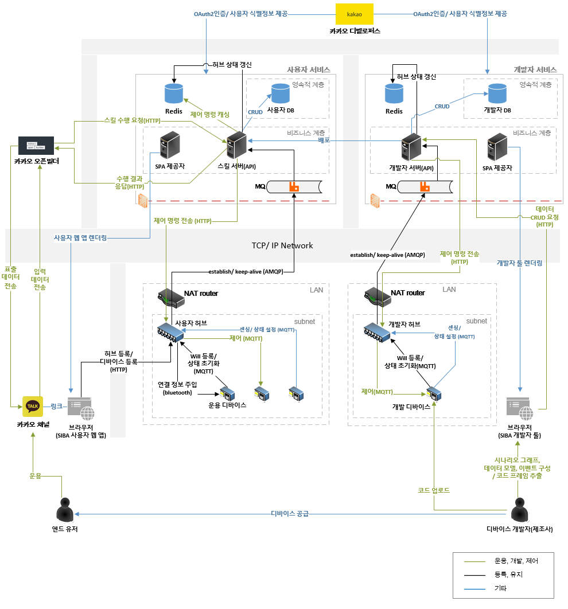
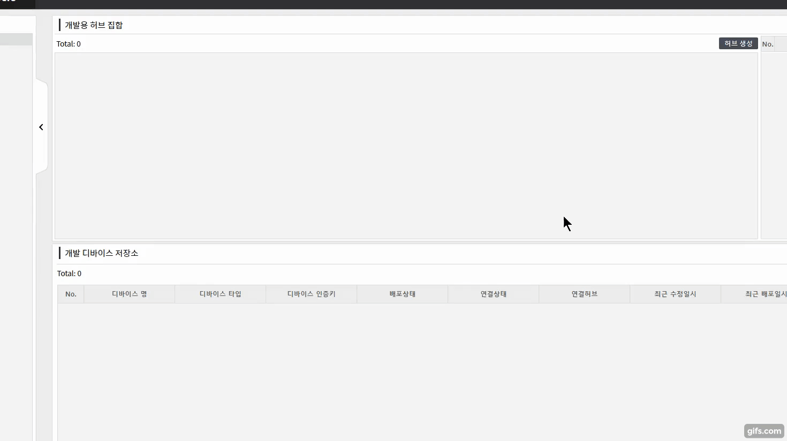
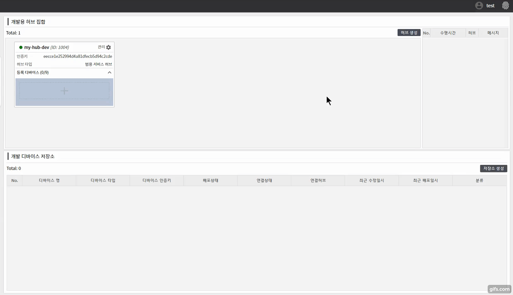
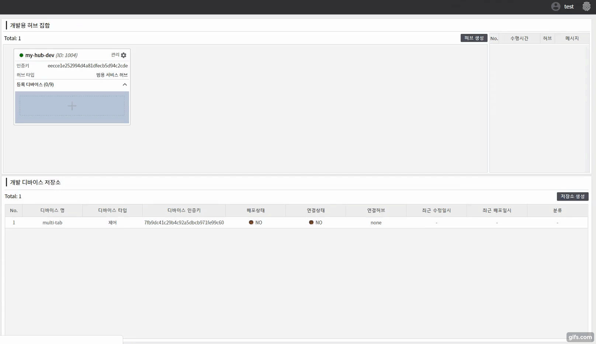
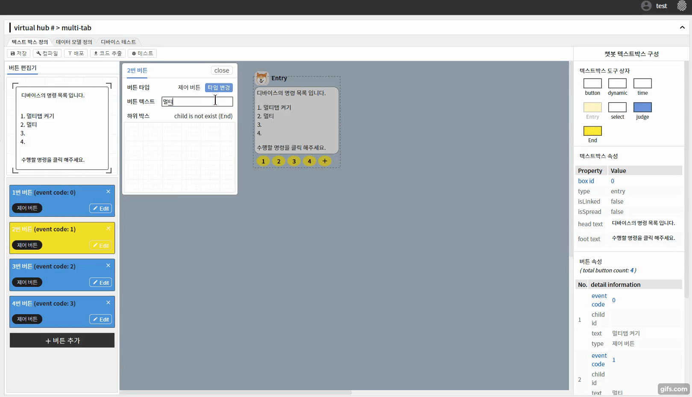
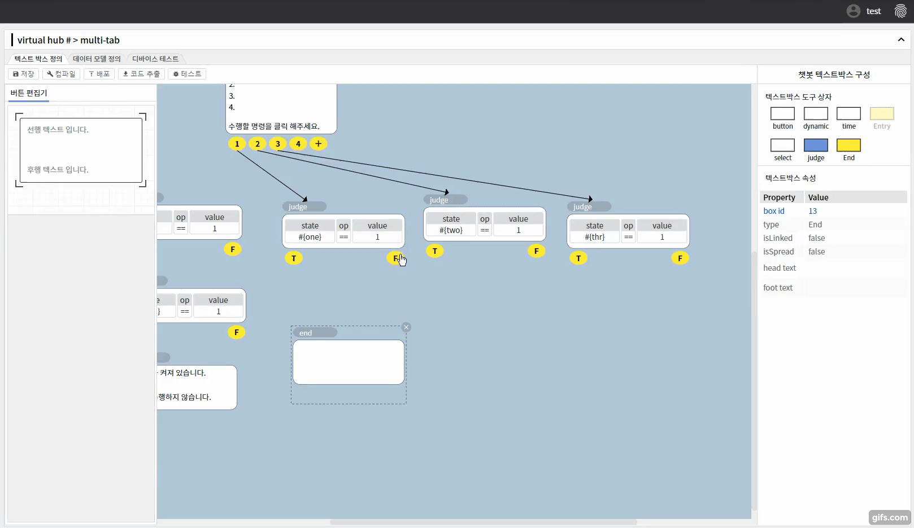
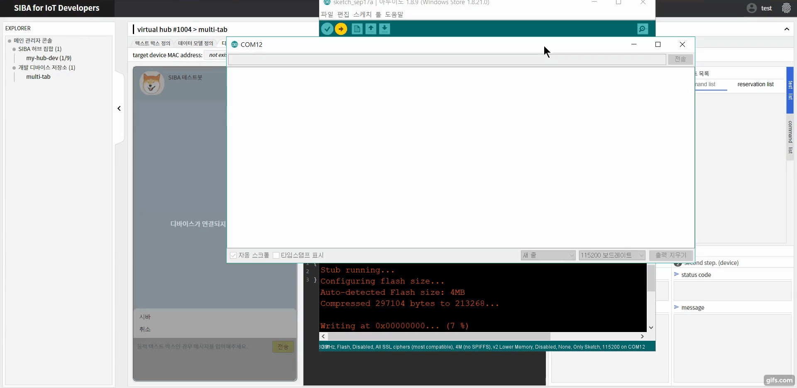
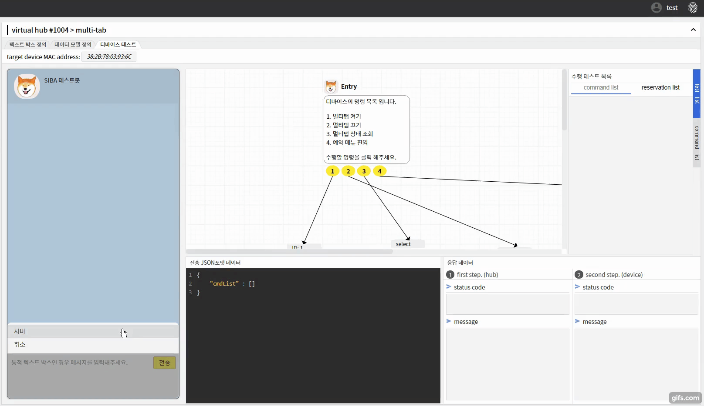

<center></center>

# <center>SIBA (<u>S</u>ocial <u>I</u>oT <u>B</u>ased on <u>A</u>I chatbot)</center>
<p align="center">
    <a href="https://poser.pugx.org/ali-irawan/xtra/license.svg"></a>
</p>

SIBA platform is available to both developers and users.<br/>
Developers do not need to develop IoT applications for users, and users can use IoT devices with KakaoTalk.<br/>
Platform for developing and operating IoT devices that can operate through Kakao Channel using scenario graph definition<br/>

***Click [here](https://www.youtube.com/watch?v=EZWuRYBgoIA&t=287s) if you want to see this project demo video in youtube.***

## Related repositories
SIBA platform is managed by multiple repositories.<br/>
If you want to see the detailed description or code, please click on the relevant repo.
- **For SIBA end-user**
    - [open builder skill server](https://github.com/DCU-ICSLab/siba-BE-usr)
    - [end-user web app](https://github.com/DCU-ICSLab/siba-FE-usr)
    - [end-user IoT-hub](https://github.com/DCU-ICSLab/siba-mid)
- **For SIBA developer**
    - [developer server](https://github.com/DCU-ICSLab/siba-BE-dev)
    - [developer web tool](https://github.com/DCU-ICSLab/siba-FE-dev)
    - [developer IoT-hub](https://github.com/DCU-ICSLab/SIBA-hub-developer)
    - [SIBA arduino library](https://github.com/DCU-ICSLab/SIBA)

## System architecture

<center></center>

## how to make SIBA IoT device?
- Steps 1 through 4 prepare the development hub and only need to be preceded once as needed. One development hub can connect up to nine devices.
If you want to connect more than nine devices, you need to connect an additional development hub to your developer tools.
- Steps 5 through 11 describe the flow of developing one new device.
- In addition, it is recommended to use NodeMCU boards, which do not require ESP module wiring when developing devices. Currently only Arduino-style libraries are supported, but there are plans to support ARM board libraries in the future.
#### 1. Preparing the SIBA arduino library
```powershell
cd $env:HOMEPATH\Documents\Arduino\libraries & git clone https://github.com/DCU-ICSLab/SIBA.git
```

#### 2. Defining hub frames in developer tool & copy hub's UUID
Click the Add Hub button in the upper right corner, then define the hub name and select the hub type.
<p align="center">
    
</p>

#### 3. git clone & set siba-hub-config.yml file
1. clone the developer hub file that contains the docker-compose file and the image-specific configuration file

    ```bash
    git clone https://github.com/DCU-ICSLab/SIBA-hub-developer.git
    ```
1. In the hubAuthenticationKey part, paste the UUID of the issued hub and define ssid and wpa_passphrase as the desired strings.
    ```yml
    #siba-hub-config.yml file example
    options:
        #insert u re hub auth key (32 characters)
        hubAuthenticationKey: 

        #insert your hub SSID name
        iotHubSsid: siba-hub-developers

        #insert your hub wpa_passphrase (more then 8 characters)
        iotHubPassword: raspberry
    ```

#### 4. launch developer hub
Docker and Docker-compose must be installed before. If it is not installed, please refer to [this link](https://jonathanmeier.io/install-docker-and-docker-compose-raspberry-pi/).<br/>
Then run the following command on the terminal:
```bash
docker-compose up
```

#### 5. Create Device's Scenario graph repo & Attach device repo to hub
You can create a device repo by clicking the Create Device button and entering the device name and device type.<br/>
You can link the device repo to the hub later, but you must link to perform the device test.
<p align="center">
    
    
</p>

#### 6. Defining the state values used in scenario graphs and devices
More detailed rules for defining scenario graphs are provided in [developer web tool repo](https://github.com/DCU-ICSLab/siba-FE-dev).<br/>
In summary, scenario graphs can include and link various kinds of text boxes. In addition, each button of the button text box and the entry box can be assigned specific functions, and the text boxes that can be connected to the lower part are different according to the assigned functions.

- define scenario graph examples
<p align="center">
    
    
</p>

#### 7. Code Frame Extraction for SIBA IoT Devices & Copy to clipboard
Based on the scenario graph defined, the corresponding code frame for the device can be extracted.<br/>
For a description of each part of the code frame, see the [SIBA library repo](https://github.com/DCU-ICSLab/SIBA).

<p align="center">
    
</p>

#### 8. Write the logic code you want in the code frame

#### 9. device's code build & upload
When you have finished writing your logic code, upload it to the target board. After uploading, the connection information is immediately reflected in the developer tools.

<p align="center">
    
</p>

#### 10. Testing that the device works in the developer tools
Test in the developer tool whether the device logic corresponding to the scenario graph you defined is performing normally.<br/>
If an error occurs during the test, you may need to modify the logic code or modify part of the scenario graph for normal operation.

<p align="center">
    
</p>

#### 11. Click the Deploy button to deploy to the skill server
Is all logic code working normally? If so, now you can deploy the scenario graph and state values you defined to the skill server. By deploying as a skill server and supplying users with developed IoT devices, users can use the devices on Kakao channels according to the scenario graphs you define.

## how to use SIBA IoT device?
**1) add kakao channel & Connect your hub to your router by wire.**

**2) Click the Join button to access your web app and sign in with your Kakao ID**

**3) Connect your smartphone wirelessly to the router to which your hub is connected**

**4) In your web app, click the Scan button to identify if the user hub exists, and add the hub if it exists**

**5) click the Scan Device button to scan and add a device**

**6) From then on, users can operate the device by clicking the SIBA button on the Kakao channel**

## Team QuadCore members
- Gyojun Ahn (Project Leader)
- Sangwon Lee
- Jinhyeok Kim
- Sohyeon Jeon